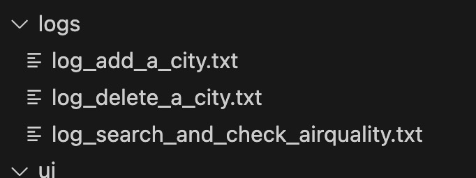
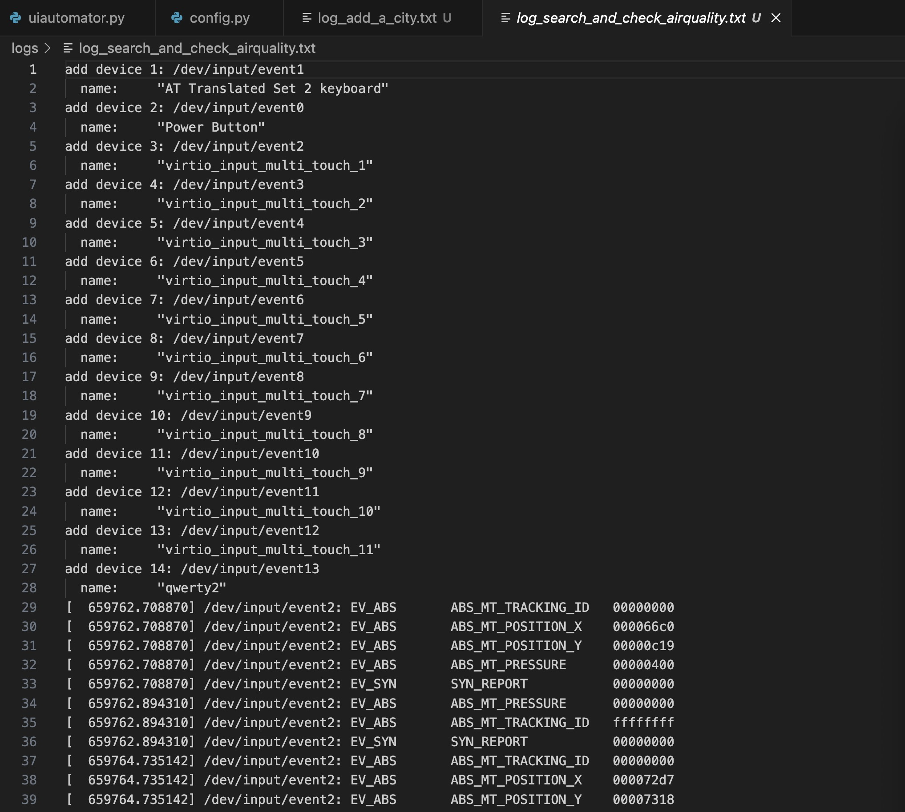
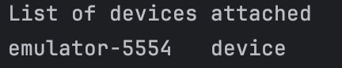
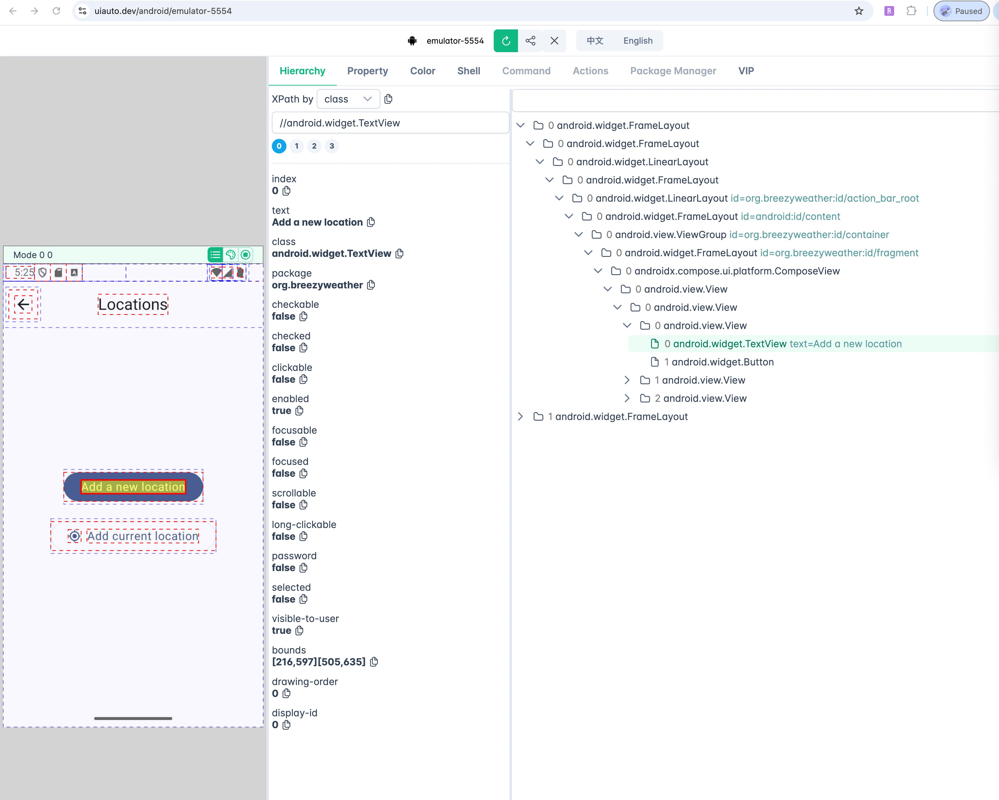
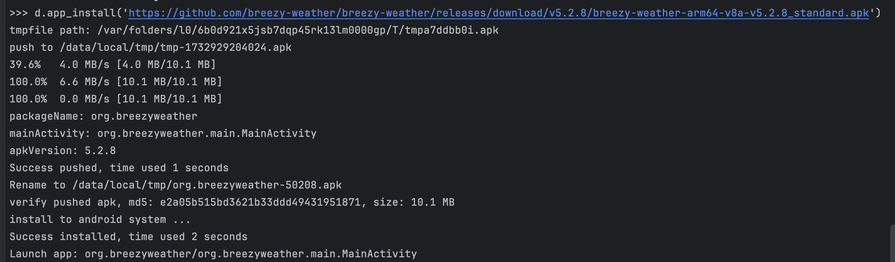
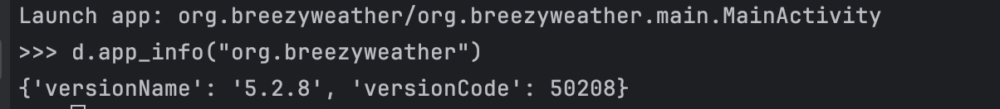
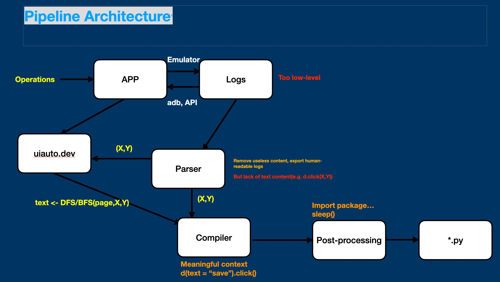
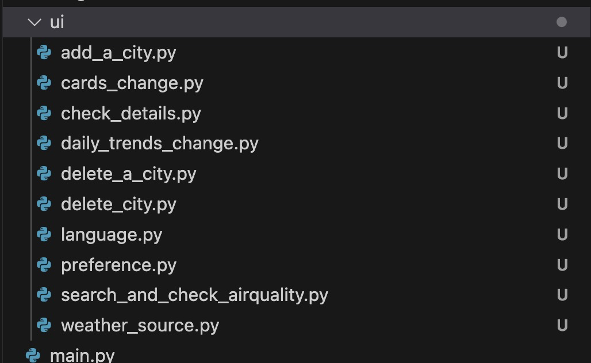
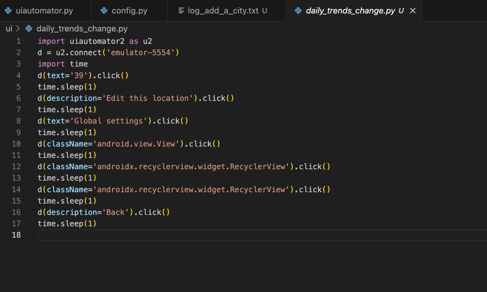

# Android-TestGPT

# Project Overview

Developed an abstract model by identifying common UI event sequences across mobile apps with similar functionalities, such as airline booking processes. This model streamlines test case generation, helps ensure good coverage in software engineering testing, and optimizes performance for new Android applications. The project was implemented based on UiAutomator, with test logic written in Python, and Android Studio was used as the Integrated Development Environment.

## Problems accounted：

The next step is to use existing tools to automate the collection of sequences. For example, this can be achieved by writing a BFS or DFS algorithm to build a tree and collect sequences. However, even for a simple application, each page often has numerous branches. The plan is to first manually collect sequences and write each sequence into automated code to build the tree, but this approach is extremely labor-intensive. In cases of complex UIs, the number of page branches can grow rapidly, potentially causing the automation algorithm to encounter a state-space explosion problem.

## Solution Proposal

To address the challenges encountered, I plan to develop a tool that can automatically convert direct user interactions on a mobile device (such as mouse clicks and keyboard inputs) into UI sequences, generating executable .py code for those sequences. This way, users can simply perform manual operations on the device to easily collect sequences, rather than manually writing automation code for each sequence. This approach can save a significant amount of time and resources.

When manually interacting with a mobile app on an Android Studio emulator, information is logged into a `logs` file that records all actions performed. 



​		

However, the content is overly verbose and low-level, making it difficult to extract meaningful UI sequence information directly. Even large language models like ChatGPT struggle to accurately extract relevant information from these logs. If a tool could process and simplify the logs into meaningful data, it would be possible to generate effective UI sequences (using UiAutomator2's API) and immediately produce executable `.py` files.

Previously, the plan was to use existing tools to automate sequence collection by implementing a BFS or DFS algorithm to build a tree of sequences. However, even simple applications often have pages with numerous branches. The initial approach involved manually collecting sequences and converting each into automated code to construct the tree, but this process proved highly labor-intensive. For complex UIs, the rapid growth of page branches could lead to state-space explosion, making the automation algorithm challenging to scale effectively.

Therefore, I plan to create a tool that converts user interactions on a mobile device (e.g., clicks and inputs) into executable `.py` UI sequences, simplifying sequence collection and eliminating the need to manually write automation code. This will save significant time and resources.


# Background

While interacting with a mobile app on an Android Studio emulator, all actions are recorded in a `logs` file. However, these logs are excessively verbose and low-level, making it challenging to extract meaningful UI sequence information. Even advanced language models like ChatGPT struggle to accurately identify relevant details. A tool capable of processing and simplifying these logs into actionable data could streamline the creation of effective UI sequences using UiAutomator2's API, enabling the generation of executable `.py` files directly.


# Environment Setup

1. Install Python (Python 3.12.7), install `uiautomator2`, and install Android Studio.

2. Use **Android Studio's Emulator** (Android Virtual Device, AVD) as a substitute for a physical Android device. Create a new virtual device with a resolution of 720x1280 (xhdpi), and select an Android 15.0 version system image with API Level 35.

3. Verify that the emulator is running by opening a terminal and running the following command:

```
adb devices
```

The result shows that it is running successfully, and ADB has successfully connected to the emulator.

```
List of devices attached
emulator-5554   device
```



4. Initialize `uiautomator2` and deploy its service to the emulator. Install `uiautomator-server` and `atx-agent` on the emulator by running the following command in the terminal:

   ```
   python -m uiautomator2 init
   ```

   

5. Install UI Inspector. Open [https://uiauto.dev](https://uiauto.dev/) in the browser to view the interface structure of the current device.

   ```
   pip install uiautodev
   uiauto.dev
   ```

   

6. Connect to the device created before.

   ```py thon
   import uiautomator2 as u2
   
   d = u2.connect('emulator-5554') # alias for u2.connect_usb('123456f')
   print(d.info)
   ```

The result is:

```python
>>> d = u2.connect('emulator-5554')
>>> print(d.info)
{'currentPackageName': 'com.google.android.apps.nexuslauncher', 'displayHeight': 1280, 'displayRotation': 0, 'displaySizeDpX': 360, 'displaySizeDpY': 640, 'displayWidth': 720, 'productName': 'sdk_gphone64_x86_64', 'screenOn': True, 'sdkInt': 35, 'naturalOrientation': True}

```

7. Find an android mobile app(Breezy Weather v5.2.8) as test and lauch it.

   ```
   d.app_install('https://github.com/breezy-weather/breezy-weather/releases/download/v5.2.8/breezy-weather-arm64-v8a-v5.2.8_standard.apk')
   ```

   

   8. Get app info:

      


# Design



First, a user performs a series of manual operations on an app using the Android Studio emulator. Android Studio logs these operations into a `log` file, but the content is excessively verbose and low-level. To address this, we process and simplify the content using a parser, removing unnecessary information to produce human-readable logs. However, this step results in missing text details. For instance, if a button is clicked, the log might only show `d.click(X, Y)`, where `X, Y` represent the coordinates of the click on the screen, but it does not indicate what was clicked.

The next step uses the UIAuto.DEV tool to search the page via BFS/DFS based on the `(X, Y)` coordinates to identify the corresponding button and retrieve its text content. This allows us to map `(X, Y)` coordinates to specific UI elements. Both the coordinates and the text content are then processed in a compiler to generate APIs such as `d(text="save").click()` for UiAutomator2.

Finally, additional steps are taken to refine the sequence, such as importing necessary packages and adding `sleep()` functions to account for page transitions (to avoid errors from proceeding too quickly). This results in a fully executable `.py` file that translates manual operations into a complete and functional UI sequence.

This project aims to streamline the process of Android UI testing by automatically generating Python scripts that leverage the `uiautomator2` API. These scripts faithfully replicate user interactions on Android devices or emulators, enabling developers to reuse the generated sequences as automated test cases. By automating the creation of UI test scripts, the system addresses key challenges such as the manual effort required to write tests, inconsistencies in reproducing test cases, and the difficulty of mapping raw input logs to meaningful UI interactions.

Android application testing is a critical component of the software development lifecycle, ensuring that apps perform reliably across a variety of devices and user scenarios. However, writing UI test cases often involves labor-intensive processes, requiring developers to understand application workflows, identify appropriate UI elements, and translate these interactions into code.

This project proposes an automated approach where interaction logs generated during manual testing sessions on Android devices are analyzed to produce reusable test scripts. These scripts are designed to:

1. Mimic the original user actions.

2. Ensure precise interactions with application UI elements using the `uiautomator2` API.

3. Be executed on emulators or physical devices to validate app functionality.


#### **Pipeline Architecture**

##### **1. `main.py` (Entry Point)**

- **Purpose**: Acts as the central controller for the pipeline, orchestrating the parsing, processing, and script generation tasks.
- **Key Functions**:
  - Parses command-line arguments to accept a log file, target application, and output file for the generated script.
  - Connects to the Android emulator or physical device using `uiautomator2`.
  - Executes the following workflow:
    1. Stops the target application (if running).
    2. Starts the target application after a brief delay to simulate app launch conditions.
    3. Parses interaction logs to create `uiautomator2` commands.
    4. Executes these commands on the emulator to validate correctness.
    5. Outputs a Python script replicating the user interactions.

##### **2. `parser.py` (Log Parsing with State Machine)**

- **Purpose**: Translates raw device interaction logs into high-level UI actions using a finite state machine.
- **Key Features**:
  - Keyboard Input Parsing
    - Identifies text input events and processes keypress sequences into meaningful strings.
    - Handles special keys such as `ENTER` and transitions between text input and other states.
  - Mouse Input Parsing
    - Converts raw touch coordinates into screen positions using a scaling factor derived from the emulator's resolution.
    - Detects touch gestures such as clicks and drags.
  - State Management
    - Transitions between idle, keyboard input, and mouse input states to ensure all interactions are captured.

##### **3. `io.py` (Log File Handler)**

- **Purpose**: Processes the log file to extract relevant interaction data such as device type, command, and parameters.
- **Key Features**:
  - Log Parsing
    - Uses regular expressions to extract and structure log data.
    - Ensures only valid entries are processed by skipping comments and invalid lines.
  - Error Handling
    - Provides clear error messages for issues such as missing or inaccessible log files.
- **Output**: A list of structured log entries, each containing fields like device name, command type, actual command, and parameter values.

##### **4. `uiautomator.py` (UI Element Analysis and Script Generation)**

- **Purpose**: Converts raw interactions into executable `uiautomator2` commands by analyzing the application’s UI hierarchy.
- **Key Features**:
  - UI Element Identification
    - Parses the app’s XML hierarchy to identify UI elements using attributes such as `text`, `content-desc`, and `class`.
    - Prioritizes elements based on defined criteria:
      - Text attribute (highest priority).
      - Content description attribute.
      - Class attribute with the smallest bounding box area (fallback).
  - Interaction Mapping
    - Matches screen coordinates from touch events to UI elements and generates API commands such as `.click()` or `.send_keys()`.
  - Script Output
    - Generates a standalone Python script that can be executed independently to reproduce the captured interactions.
    - Outputs the script to a file or displays it on the console for validation.

##### **5. `config.py` (Configuration File)**

- **Purpose**: Stores global settings and constants required by other components.
- **Key Features**:
  - Device Settings
    - Emulator device name (`DEVICE_NAME`) and resolution settings (`SCREEN_WIDTH`, `SCREEN_HEIGHT`).
  - Key Mappings
    - Maps raw key codes to their corresponding characters or actions.
  - Prioritization
    - Defines the hierarchy for selecting UI elements during interaction mapping.

#### **Workflow**

1. **Log Collection**:
   - The Android emulator generates interaction logs during manual testing sessions.n  
   - These logs contain raw input data such as keypress events and touch gestures.
2. **Parsing and State Management**:
   - `parser.py` interprets the logs, identifying keyboard and mouse inputs.
   - Captures relevant information such as text strings and touch coordinates.
3. **UI Hierarchy Analysis**:
   - `uiautomator.py` parses the app’s XML structure to map interactions to specific UI elements.
   - Determines the most suitable API commands to replicate the interaction.
4. **Script Generation**:
   - The pipeline generates a Python script containing `uiautomator2` commands.
   - The script is saved to a specified file and can be executed to reproduce the interactions.
5. **Validation**:
   - The script is executed on the emulator to ensure it accurately replicates the original user actions.


# Implementation Details

#### **Example Usage**

**Command:**

```bash
python main.py --log path/to/logfile.log --app com.example.myapp --out output_script.py
```

**Workflow:**

1. Stops and restarts the app specified by `--app`.
2. Processes the log file specified by `--log`.
3. Generates a Python script containing `uiautomator2` commands.
4. Executes the generated commands on the Android emulator.

**Generated Script:**

```
import uiautomator2 as u2
d = u2.connect('emulator-5554')
import time
d(description='Location list').click()
time.sleep(1)
d(description='Add a new location').click()
time.sleep(1)
d(text='Search for a location…').click()
time.sleep(1)
d.send_keys("menlo park")
d.send_action()
time.sleep(1)
time.sleep(1)
d(text='United States, San Mateo').click()
time.sleep(1)
d(text='Save').click()
time.sleep(1)
d(text='United States, San Mateo').click()
time.sleep(1)
```

------

#### Detailed Documentation

##### main.py

```python
# Importing necessary modules and components
from android_testgpt import io, parser  # Custom modules for log file handling and parsing
from android_testgpt import config  # Configuration settings for the application
from android_testgpt.uiautomator import uiautomator  # Custom class for generating uiautomator2 commands
import sys  # For handling system-level arguments and exiting the program
import argparse  # For parsing command-line arguments
import time  # For introducing delays during app stop/start operations
import uiautomator2 as u2  # External library for controlling Android devices and emulators

# The entry point of the program
if __name__ == "__main__":  
    # Setting up a command-line argument parser
    command_parser = argparse.ArgumentParser(description='Generate auto-testing for Android Applications')
    
    # Adding a required argument for the path to the log file
    command_parser.add_argument('--log', type=str, help='Path to log file')
    
    # Adding a required argument for the application name (package name of the Android app)
    command_parser.add_argument('--app', type=str, help='Application Name')
    
    # Adding an optional argument for the output file to store the generated uiautomator2 commands
    command_parser.add_argument('--out', type=str, help='File to store uiautomator2 command')
    
    # Parsing the command-line arguments
    args = command_parser.parse_args()

    # Instantiating the uiautomator class to store and execute UI commands
    ui = uiautomator()
    
    # Parsing the log file specified by the user
    # This step extracts raw device interactions from the log file
    parsed_logs = io.parse_log_file(args.log)
    
    # Using the parser to convert raw logs into a sequence of uiautomator2 commands
    # The commands are stored in the `ui` instance
    instructions = parser.parse(parsed_logs, ui)
    
    # Writing the generated commands to the console for debugging/validation
    ui.write_to_stdout()

    # Connecting to the Android device or emulator specified in the configuration
    d = u2.connect(config.DEVICE_NAME)
    
    # Stopping the specified application if it is already running
    d.app_stop(args.app)
    
    # Introducing a delay to ensure the application has stopped completely
    time.sleep(5)
    
    # Starting the specified application
    d.app_start(args.app)
    
    # Introducing a delay to allow the application to load
    time.sleep(10)
    
    # Executing the generated uiautomator2 commands on the connected device/emulator
    ui.exec(d)
    
    # Writing the generated commands to the specified output file
    # This output file can be used to reproduce the interactions later
    ui.write_to_file(args.out)
```

#### Explanation of Key Components:

- **Command-line Arguments**:
  - `--log`: Specifies the log file containing raw device interaction logs.
  - `--app`: The package name of the application being tested (e.g., `com.example.myapp`).
  - `--out`: The name of the file to save the generated test script.
- **Workflow**:
  - Parses the log file to extract user interactions.
  - Converts interactions into uiautomator2 API calls using the `parser` and `uiautomator` modules.
  - Validates and executes the commands on an emulator or device.
  - Outputs the generated script for future use.

##### parser.py

```python
# Importing necessary modules and components
from . import config  # Importing global configuration settings
from . import uiautomator  # Importing the uiautomator class for UI command handling
from enum import Enum  # Enum is used to define parser states

# Class to represent a point (X, Y) on the screen
class Point:
    def __init__(self, point=None):
        # If a point is provided, initialize X and Y with its values
        if point is not None:
            self.X = point[0]
            self.Y = point[1]
        # Otherwise, initialize X and Y to zero
        else:
            self.X = 0
            self.Y = 0

# Function to calculate screen coordinates from raw input data
def calculate_screen_coordinates(raw_x_hex, raw_y_hex):
    # Convert raw hex coordinates to integers
    raw_x = int(raw_x_hex.replace('0x', ''), 16)
    raw_y = int(raw_y_hex.replace('0x', ''), 16)

    # Scale the raw coordinates to screen resolution
    scale_factor_x = config.SCREEN_WIDTH / config.MAX_RAW_X
    scale_factor_y = config.SCREEN_HEIGHT / config.MAX_RAW_Y
    screen_x = int(raw_x * scale_factor_x)
    screen_y = int(raw_y * scale_factor_y)

    # Return the scaled screen coordinates
    return screen_x, screen_y

# Enum to represent the different states of the parser
class ParserState(Enum):
    IDLE = 0  # Idle state, waiting for input
    READING_STRING = 1  # Reading keyboard input (text)
    READING_MOUSE_INPUT = 2  # Reading mouse input (clicks or gestures)

# Function to parse logs and generate UI commands
def parse(parsed_logs, ui):
    # Initial state of the parser
    state = ParserState.IDLE

    # Variable to store the current string being built from keyboard input
    current_string = ''

    # Object to store the current mouse coordinates
    p = Point()

    # Loop index for iterating through log entries
    index = 0

    # Total number of log entries
    total_entries = len(parsed_logs)

    # Loop through all log entries
    while index < total_entries:
        # Extract the current log entry
        entry = parsed_logs[index]

        # Extract fields from the log entry
        device_name = entry['device_name']  # Device name (e.g., keyboard or mouse)
        command = entry['command']  # Command type (e.g., EV_ABS)
        actual_command = entry['actual_command']  # Specific command (e.g., ABS_MT_POSITION_X)
        parameter = entry['parameter']  # Parameter value associated with the command

        # State: IDLE (waiting for input)
        if state == ParserState.IDLE:
            # Transition to READING_STRING if the keyboard is detected
            if device_name == config.KEYBOARD_DEVICE:
                state = ParserState.READING_STRING
                continue
            # Transition to READING_MOUSE_INPUT if the mouse is detected
            elif device_name == config.MOUSE_DEVICE:
                state = ParserState.READING_MOUSE_INPUT
                continue

        # State: READING_STRING (handling keyboard input)
        elif state == ParserState.READING_STRING:
            # If the device is still the keyboard
            if device_name == config.KEYBOARD_DEVICE:
                if parameter == 'DOWN':  # Key is pressed
                    # Map the actual command to a key using the configuration
                    key = config.KEY_MAPPING.get(actual_command, config.DEFAULT_KEY_VALUE)

                    # Handle special keys or append regular keys to the string
                    if key == 'ENTER':  # If ENTER is pressed
                        # Add the string to the UI commands and reset
                        print(f"Collected string 1: {current_string}")
                        ui.add_text_input(current_string + "\n")
                        current_string = ''
                        state = ParserState.IDLE  # Return to IDLE state
                    elif len(key) == 1:  # Append regular characters to the string
                        current_string += key
                    else:
                        print(f"Special Key Pressed: {key}")  # Handle special keys
            # If the device switches to mouse
            elif device_name == config.MOUSE_DEVICE:
                # Finalize the current string and transition to READING_MOUSE_INPUT
                print(f"Collected string 2: {current_string}")
                ui.add_text_input(current_string)
                current_string = ''
                state = ParserState.READING_MOUSE_INPUT
                continue

        # State: READING_MOUSE_INPUT (handling mouse clicks or gestures)
        elif state == ParserState.READING_MOUSE_INPUT:
            # If the device is still the mouse
            if device_name == config.MOUSE_DEVICE:
                if command == 'EV_ABS':  # Absolute positioning event
                    if actual_command == 'ABS_MT_POSITION_X':  # X-coordinate
                        p.X = parameter
                    elif actual_command == 'ABS_MT_POSITION_Y':  # Y-coordinate
                        p.Y = parameter
                        # Convert raw coordinates to screen coordinates
                        p.X, p.Y = calculate_screen_coordinates(p.X, p.Y)
                        print(f"Mouse click at: ({p.X}, {p.Y})")
                        ui.add_point_access(p.X, p.Y)  # Add the point to the UI commands
                elif command == 'EV_SYN' and actual_command == 'SYN_REPORT':
                    # SYN_REPORT indicates the end of an event, no action needed
                    pass
            # If the device switches back to keyboard
            elif device_name == config.KEYBOARD_DEVICE:
                # Transition back to READING_STRING
                state = ParserState.READING_STRING
                continue

        # Move to the next log entry
        index += 1
```

### Key Components:

- **State Machine**:
  - Manages transitions between parsing keyboard inputs (`READING_STRING`) and mouse inputs (`READING_MOUSE_INPUT`).
  - Ensures proper handling of multi-device input scenarios.
- **Keyboard Input Parsing**:
  - Builds a string from sequential keypresses.
  - Handles special keys such as `ENTER` and `BACKSPACE`.
- **Mouse Input Parsing**:
  - Extracts raw coordinates and scales them to screen dimensions.
  - Adds mouse click points to the UI commands.


##### io.py

```python
# Importing necessary modules
import re  # Regular expressions for pattern matching in log parsing
import sys  # System-specific parameters and functions (used for error handling and program exit)

# Function to parse a log file and extract device interaction details
def parse_log_file(file_path):
    """
    Parse a log file to extract device name, actual command, and parameter.

    Args:
        file_path (str): Path to the log file.

    Returns:
        list of dict: A list of parsed log entries, each containing device name, command, 
        actual command, and parameter.
    """
    # List to store all the parsed log entries
    log_entries = []

    # Define the regex pattern to extract the required fields from each log line
    # Pattern explanation:
    # - ^\[.*?\]: Matches a timestamp or similar prefix enclosed in square brackets (optional to capture).
    # - (/dev/input/\S+): Matches the device name (e.g., /dev/input/event2).
    # - (\S+): Matches the command type (e.g., EV_ABS, EV_SYN).
    # - (\S+): Matches the actual command (e.g., ABS_MT_POSITION_X, SYN_REPORT).
    # - (\S+): Matches the parameter value (e.g., 0x1234).
    pattern = re.compile(
        r"^\[.*?\]\s+(/dev/input/\S+):\s+(\S+)\s+(\S+)\s+(\S+)"
    )

    # Read the log file and parse each line
    try:
        # Open the specified log file in read mode
        with open(file_path, 'r') as log_file:
            # Loop through each line in the file
            for line in log_file:
                # Remove leading and trailing whitespace from the line
                line = line.strip()

                # Skip empty lines or lines starting with '#' (comments)
                if not line or line.startswith("#"):
                    continue

                # Match the line against the regex pattern
                match = pattern.match(line)
                if match:
                    # Extract the relevant fields from the matched line
                    device_name = match.group(1)  # The name of the input device
                    command = match.group(2)  # The command type
                    actual_command = match.group(3)  # The actual command being issued
                    parameter = match.group(4)  # The parameter associated with the command

                    # Append the parsed data as a dictionary to the log_entries list
                    log_entries.append({
                        "device_name": device_name,
                        "command": command,
                        "actual_command": actual_command,
                        "parameter": parameter
                    })
    except FileNotFoundError:
        # Handle the case where the specified file does not exist
        print(f"Error: File '{file_path}' not found.")
        sys.exit(1)  # Exit the program with an error status

    # Return the list of parsed log entries
    return log_entries

# Main function to test or run the log parser independently
def main():
    # Ensure a file path is provided as a command-line argument
    if len(sys.argv) != 2:
        # Display usage information if no file path is provided
        print("Usage: python io.py <log_file>")
        sys.exit(1)  # Exit the program with an error status

    # Get the log file path from the command-line arguments
    log_file_path = sys.argv[1]

    # Parse the specified log file
    parsed_logs = parse_log_file(log_file_path)

    # Print each parsed log entry for debugging or verification
    for entry in parsed_logs:
        print(f"Device: {entry['device_name']}, Command: {entry['command']}, "
              f"Actual Command: {entry['actual_command']}, Parameter: {entry['parameter']}")

# Entry point for the script when executed as a standalone program
if __name__ == "__main__":
    main()
```

------

### **Detailed Explanation of Key Components**

#### **Imports**

- `re`
  - Used to define a regex pattern for parsing each line in the log file.
- `sys`
  - Provides functionality for error handling and program termination (e.g., `sys.exit`).

------

#### **`parse_log_file(file_path)`**

- **Purpose**:
  - Parses the specified log file to extract and structure device interaction data.
- **Core Logic**:
  - Regex Pattern
    - Matches lines with interaction data in the expected format.
    - Captures four fields: device name, command, actual command, and parameter.
  - File Reading
    - Opens the file and reads it line by line.
    - Skips empty lines and comments (lines starting with `#`).
  - Data Extraction
    - Uses the regex pattern to extract fields from matching lines.
    - Stores the extracted data as a dictionary in the `log_entries` list.
- **Error Handling**:
  - If the file does not exist, prints an error message and terminates the program.
- **Output**:
  - Returns a list of parsed log entries.

------

#### **`main()`**

- **Purpose**:
  - Provides a standalone interface for testing the log parser.
- **Workflow**:
  - Validates that a file path is provided as a command-line argument.
  - Parses the specified file using `parse_log_file()`.
  - Prints each parsed log entry for verification.
- **Error Handling**:
  - Exits with an error message if no file path is provided.

------

#### **Script Execution (`if __name__ == "__main__":`)**

- **Purpose**:
  - Ensures the script can be executed independently for testing or debugging purposes.
- **Workflow**:
  - Calls `main()` when the script is run as a standalone program.

------

### **Example Usage**

1. **Command**:

   ```bash
   python io.py example_log.txt
   ```

2. **Input Log File (`example_log.txt`)**:

   ```bash
   [1577836800.123456] /dev/input/event2: EV_ABS ABS_MT_POSITION_X 0x1234
   [1577836800.123457] /dev/input/event2: EV_ABS ABS_MT_POSITION_Y 0x5678
   [1577836800.123458] /dev/input/event2: EV_SYN SYN_REPORT 0
   ```

3. **Output**:

   ```bash
   Device: /dev/input/event2, Command: EV_ABS, Actual Command: ABS_MT_POSITION_X, Parameter: 0x1234
   Device: /dev/input/event2, Command: EV_ABS, Actual Command: ABS_MT_POSITION_Y, Parameter: 0x5678
   Device: /dev/input/event2, Command: EV_SYN, Actual Command: SYN_REPORT, Parameter: 0
   ```

This documentation provides clear guidance on the functionality and behavior of each component in the `io.py` script.


##### uiautomator.py

```python
# Importing necessary modules
import xml.etree.ElementTree as ET  # For parsing the XML hierarchy of the application UI
import re  # Regular expressions for string matching and manipulation
from . import config  # Importing global configuration settings and constants

# Function to print information about a given UI node
def print_node_info(node):
    """
    Print detailed information about a UI node for debugging purposes.

    Args:
        node (Element): A UI node extracted from the XML hierarchy.
    """
    class_name = node.attrib.get('class')  # The class name of the node (e.g., Button, EditText)
    resource_id = node.attrib.get('resource-id')  # The unique ID of the node
    content_desc = node.attrib.get('content-desc')  # The content description of the node
    text = node.attrib.get('text')  # The text displayed in the node
    bounds = node.attrib.get('bounds')  # The screen bounds of the node
    index = node.attrib.get('index')  # The index of the node in its parent

    # Print the collected information
    print(f"Found node:")
    print(f"  Class: {class_name}")
    print(f"  Resource ID: {resource_id}")
    print(f"  Content Description: {content_desc}")
    print(f"  Text: {text}")
    print(f"  Bounds: {bounds}")
    print(f"  Index: {index}")
    print()

# Function to save node information to a list
def save_node_info(node, node_list):
    """
    Collect and store detailed information about a UI node.

    Args:
        node (Element): A UI node extracted from the XML hierarchy.
        node_list (list): A list to store information about nodes.
    """
    class_name = node.attrib.get('class')  # The class name of the node
    resource_id = node.attrib.get('resource-id')  # The unique ID of the node
    content_desc = node.attrib.get('content-desc')  # The content description of the node
    text = node.attrib.get('text')  # The text displayed in the node
    bounds = node.attrib.get('bounds')  # The screen bounds of the node
    index = node.attrib.get('index')  # The index of the node in its parent

    # Append the node information as a tuple to the list
    node_list.append((class_name, resource_id, content_desc, text, bounds, index))

# Function to parse the bounds attribute into coordinates
def parse_bounds(bounds_str):
    """
    Parse a bounds string into numerical coordinates.

    Args:
        bounds_str (str): The bounds string (e.g., "[10,20][100,200]").

    Returns:
        tuple: A tuple containing the parsed coordinates (left, top, right, bottom).
    """
    # Use regex to extract numerical values from the bounds string
    match = re.match(r'\[(\d+),(\d+)\]\[(\d+),(\d+)\]', bounds_str)
    if match:
        # Convert the extracted values to integers and return as a tuple
        left, top, right, bottom = map(int, match.groups())
        return left, top, right, bottom
    else:
        # Return None if the bounds string is invalid
        return None

# Function to calculate the area of a node's bounding box
def calculate_area(bounds_str):
    """
    Calculate the area of a node's bounding box.

    Args:
        bounds_str (str): The bounds string (e.g., "[10,20][100,200]").

    Returns:
        float: The area of the bounding box.
    """
    bounds = parse_bounds(bounds_str)  # Parse the bounds string into coordinates
    if bounds:
        left, top, right, bottom = bounds
        return (right - left) * (bottom - top)  # Calculate the area of the rectangle
    return float('inf')  # Return a large number if the bounds are invalid

# Function to check if a point is within a node's bounds
def point_in_bounds(bounds_str, x, y):
    """
    Check if a point (x, y) is within a node's bounding box.

    Args:
        bounds_str (str): The bounds string (e.g., "[10,20][100,200]").
        x (int): The x-coordinate of the point.
        y (int): The y-coordinate of the point.

    Returns:
        bool: True if the point is within the bounds, False otherwise.
    """
    bounds = parse_bounds(bounds_str)  # Parse the bounds string into coordinates
    if bounds:
        left, top, right, bottom = bounds
        return left <= x <= right and top <= y <= bottom  # Check if the point is within bounds
    else:
        return False

# Function to recursively iterate over all nodes in the UI hierarchy
def iterate_nodes(node, point_x, point_y, node_list):
    """
    Recursively iterate through the XML hierarchy and find nodes matching the given point.

    Args:
        node (Element): The current node being analyzed.
        point_x (int): The x-coordinate of the point.
        point_y (int): The y-coordinate of the point.
        node_list (list): A list to store matching nodes.
    """
    if node.tag == 'node':  # Check if the current element is a node
        bounds = node.attrib.get('bounds')  # Get the node's bounds
        if bounds and point_in_bounds(bounds, point_x, point_y):  # Check if the point is within bounds
            save_node_info(node, node_list)  # Save node information to the list

    # Recurse into child nodes
    for child in node:
        iterate_nodes(child, point_x, point_y, node_list)

# Function to select the most relevant node based on priority
def select_node(node_list):
    """
    Select the most relevant node based on a priority hierarchy:
    1. Nodes with non-empty 'text'.
    2. Nodes with non-empty 'content-desc'.
    3. Nodes with the smallest bounding box.

    Args:
        node_list (list): A list of candidate nodes.

    Returns:
        tuple: The selected node and its priority level.
    """
    # Priority 1: Nodes where 'text' is not None or empty
    for node in node_list:
        class_name, resource_id, content_desc, text, bounds, index = node
        if text:
            return node, config.PriorityState.TEXT  # Return the node and its priority

    # Priority 2: Nodes where 'content-desc' is not None or empty
    for node in node_list:
        class_name, resource_id, content_desc, text, bounds, index = node
        if content_desc:
            return node, config.PriorityState.DESCRIPTION  # Return the node and its priority

    # Priority 3: Node with the smallest bounding box area
    smallest_area = float('inf')
    best_node = None
    for node in node_list:
        class_name, resource_id, content_desc, text, bounds, index = node
        area = calculate_area(bounds)  # Calculate the area of the bounding box
        if area < smallest_area:
            smallest_area = area
            best_node = node

    if best_node:
        return best_node, config.PriorityState.CLASS  # Return the node with the smallest area

    # If no nodes match any priority, return None
    return None, None

# Class to handle uiautomator2 commands
class uiautomator:
    def __init__(self):
        """
        Initialize the uiautomator object and prepare the command list.
        """
        self.command_list = []  # List to store the generated commands
        self.command_list.append("import time")  # Add time import for delays

    def add_point_access(self, point_x, point_y):
        """
        Add a command to simulate a click at the given point.

        Args:
            point_x (int): The x-coordinate of the click.
            point_y (int): The y-coordinate of the click.
        """
        self.command_list.append("self.d.click({}, {})".format(point_x, point_y))
        self.command_list.append("time.sleep(1)")  # Add a delay after the click

    def add_text_input(self, string):
        """
        Add a command to simulate text input.

        Args:
            string (str): The text to input.
        """
        if string == '':
            print("Empty string")
        elif string[-1] == "\n":  # Handle newline-terminated strings
            self.command_list.append("self.d.send_keys(\"{}\")".format(string[:-1]))
            self.command_list.append("self.d.send_action()")
        else:
            self.command_list.append("self.d.send_keys({})".format(string))
        self.command_list.append("time.sleep(1)")  # Add a delay after text input

    def write_to_file(self, filename):
        """
        Write the generated commands to a file.

        Args:
            filename (str): The name of the file to save the commands.
        """
        with open(filename, 'w') as log_file:
            log_file.write("import uiautomator2 as u2\n")
            log_file.write("d = u2.connect('{}')\n".format(config.DEVICE_NAME))
            for line in self.command_list:
                log_file.write(line.replace('self.', '') + '\n')

    def write_to_stdout(self):
        """
        Print the generated commands to the console.
        """
        for line in self.command_list:
            print(line)

    def exec(self, device):
        """
        Execute the generated commands on the specified device.

        Args:
            device (uiautomator2.Device): The connected device to execute commands on.
        """
        self.d = device  # Assign the connected device to the instance
        for idx, line in enumerate(self.command_list):
            if 'd.click' in line:  # Check for click commands
                print("This line contains click")
                pattern = r'self\.d\.click\(\s*([\d\.]+)\s*,\s*([\d\.]+)\s*\)'
                match = re.search(pattern, line)

                if match:
                    point_x = int(match.group(1))
                    point_y = int(match.group(2))
                    print(f"Point_x: {point_x}, Point_y: {point_y}")
                else:
                    print("No match found.")
                xml = self.d.dump_hierarchy()  # Get the UI hierarchy

                # Parse the XML and find matching nodes
                root = ET.fromstring(xml)
                node_list = []
                iterate_nodes(root, point_x, point_y, node_list)
                node, priority = select_node(node_list)
                if priority == config.PriorityState.TEXT:
                    self.command_list[idx] = f"self.d(text='{node[3]}').click()"
                elif priority == config.PriorityState.DESCRIPTION:
                    self.command_list[idx] = f"self.d(description='{node[2]}').click()"
                elif priority == config.PriorityState.CLASS:
                    self.command_list[idx] = f"self.d(className='{node[0]}').click()"
                else:
                    print("Node not found!")
            exec(line, globals(), locals())  # Execute the command
```

#### **Module Overview**

The module serves three main purposes:

1. **Parsing and Analyzing UI Nodes**:
   - Extracts information about UI elements from the app's XML hierarchy.
   - Identifies relevant nodes based on attributes like `text`, `content-desc`, and `bounds`.
2. **Mapping Interactions to Commands**:
   - Maps touch and click events to their corresponding UI elements.
   - Generates `uiautomator2` commands (e.g., `.click()`, `.send_keys()`) for interaction replay.
3. **Command Management**:
   - Stores the generated commands in a sequence.
   - Provides functionality to execute the commands on a connected device or save them to a file.

------

#### **Core Components**

##### **1. Parsing UI Nodes**

- **`print_node_info(node)`**:
  - Prints detailed information about a given UI node, including its class, resource ID, content description, text, and screen bounds.
  - Useful for debugging and verifying the XML structure of the app.
- **`save_node_info(node, node_list)`**:
  - Extracts relevant attributes (e.g., `class`, `resource-id`, `text`) from a node and appends the information to a list.
  - Prepares the data for further analysis and node selection.
- **`parse_bounds(bounds_str)`**:
  - Parses a node’s `bounds` string (e.g., `"[10,20][100,200]"`) into numerical coordinates: `(left, top, right, bottom)`.
  - Uses regular expressions to extract values and ensures the format is valid.
- **`calculate_area(bounds_str)`**:
  - Computes the area of a node’s bounding box based on its `bounds` attribute.
  - Used to identify the smallest node in cases of ambiguity, ensuring precise element selection.
- **`point_in_bounds(bounds_str, x, y)`**:
  - Checks if a given point (x, y) lies within a node’s bounding box.
  - Essential for mapping raw touch coordinates to specific UI elements.

------

##### **2. Node Selection**

- **`iterate_nodes(node, point_x, point_y, node_list)`**:
  - Recursively traverses the app's XML hierarchy.
  - Identifies all nodes whose bounds contain the given point `(point_x, point_y)`.
  - Adds matching nodes to a list for further prioritization.
- **`select_node(node_list)`**:
  - Implements a priority-based selection mechanism to identify the most relevant node:
    1. **Priority 1**: Nodes with non-empty `text` attributes (e.g., buttons labeled "Submit").
    2. **Priority 2**: Nodes with non-empty `content-desc` attributes (e.g., accessibility labels).
    3. **Priority 3**: Nodes with the smallest bounding box area, ensuring accurate selection in dense layouts.
  - Returns the selected node along with its priority level.

------

##### **3. Command Management**

- **`uiautomator` Class**:
  - Encapsulates functionality for generating, storing, and executing `uiautomator2` commands.
- **Constructor (`__init__`)**:
  - Initializes the command list with a default import statement (`import time`).
  - Prepares the object for interaction tracking and command generation.
- **`add_point_access(point_x, point_y)`**:
  - Adds a `click` command at the specified coordinates.
  - Includes a delay (`time.sleep(1)`) to ensure proper execution timing.
- **`add_text_input(string)`**:
  - Generates a command to input text into the UI.
  - Handles special cases, such as newline characters, to correctly format the command.
- **`write_to_file(filename)`**:
  - Writes the stored commands to a Python file.
  - Includes necessary imports and connection setup for `uiautomator2`.
- **`write_to_stdout()`**:
  - Prints the generated commands to the console for debugging or validation.
- **`exec(device)`**:
  - Executes the stored commands on the connected device.
  - Handles dynamic adjustments, such as replacing raw `click` commands with context-aware commands (e.g., `.text("Submit").click()`).

------

#### **Implementation Workflow**

1. **XML Parsing and Node Identification**:
   - The module begins by parsing the app’s XML hierarchy using the `uiautomator2.dump_hierarchy()` method.
   - Each node is analyzed for attributes like `bounds`, `text`, and `content-desc`.
2. **Node Matching**:
   - Touch events are mapped to nodes based on screen coordinates.
   - Matching nodes are prioritized based on their attributes to ensure the most relevant node is selected.
3. **Command Generation**:
   - Interaction data (e.g., clicks, text input) is translated into `uiautomator2` commands.
   - Commands are stored in the `uiautomator` object for sequential execution.
4. **Execution and Validation**:
   - Commands are executed on the connected device to validate their correctness.
   - Adjustments are made dynamically to ensure the commands interact with the intended elements.

------

#### **Key Design Decisions**

1. **Priority-Based Node Selection**:
   - Ensures accurate element identification in complex layouts.
   - Prioritizes text and content descriptions, as these attributes often provide semantic meaning.
2. **Dynamic Command Replacement**:
   - Converts raw `click` commands into context-aware commands (e.g., `.text("Submit").click()`) during execution.
   - Improves script readability and robustness.
3. **Modular Structure**:
   - Separates concerns into reusable functions (e.g., parsing, node selection, command management).
   - Facilitates testing and future enhancements.

------

#### **Example Workflow**

1. **Input**:
   - Raw touch coordinates `(100, 200)` from the parser.
   - App XML hierarchy with nodes and their attributes.
2. **Processing**:
   - The coordinates are matched to a node in the XML.
   - The node is analyzed and selected based on its priority.
3. **Output**:
   - A command like `d(text="Submit").click()` is generated.
   - The command is stored for execution or output to a file.


##### config.py

Below is the line-by-line, in-code documentation for `config.py`:

```python
# Importing the Enum module for creating enumerated types
from enum import Enum

# Global configuration variables

# Name of the Android device or emulator to connect to.
# This is used by uiautomator2 to identify the device.
DEVICE_NAME = "emulator-5554"

# Placeholder for an API key if external services require authentication.
# This is not actively used in the current implementation but reserved for future use.
API_KEY = "your_api_key_here"

# Flag to enable or disable debug mode.
# When True, the system may print additional logs for debugging purposes.
DEBUG_MODE = True

# Default name of the log file to be used for storing application logs.
# Can be overridden in specific use cases.
LOG_FILE = "app.log"

# Maximum raw X-coordinate value from input devices.
# This value is used for scaling raw touch inputs to screen resolution.
MAX_RAW_X = 32767

# Maximum raw Y-coordinate value from input devices.
# Similar to MAX_RAW_X, it ensures proper scaling for Y-coordinates.
MAX_RAW_Y = 32767

# Screen width of the device or emulator in pixels.
# Used for converting raw coordinates into screen coordinates.
SCREEN_WIDTH = 720

# Screen height of the device or emulator in pixels.
# Works with SCREEN_WIDTH to ensure touch points are mapped correctly.
SCREEN_HEIGHT = 1280

# Device path for keyboard input events.
# This path identifies the input event stream from the keyboard.
KEYBOARD_DEVICE = "/dev/input/event13"

# Device path for mouse input events.
# This path identifies the input event stream from the mouse or touch device.
MOUSE_DEVICE = "/dev/input/event2"

# Enumerated type to define the priority levels for UI element selection.
# This is used in the uiautomator module to prioritize how UI elements are matched.
class PriorityState(Enum):
    TEXT = 0         # Priority level for nodes with text attributes
    DESCRIPTION = 1  # Priority level for nodes with content descriptions
    CLASS = 2        # Priority level for nodes with class names (smallest bounding box area)

# Mapping of raw keyboard key codes to their corresponding characters or actions.
# This dictionary ensures that key presses are interpreted correctly.
KEY_MAPPING = {
    'KEY_ESC': 'ESC',
    'KEY_1': '1',
    'KEY_2': '2',
    'KEY_3': '3',
    'KEY_4': '4',
    'KEY_5': '5',
    'KEY_6': '6',
    'KEY_7': '7',
    'KEY_8': '8',
    'KEY_9': '9',
    'KEY_0': '0',
    'KEY_MINUS': '-',
    'KEY_EQUAL': '=',
    'KEY_BACKSPACE': 'BACKSPACE',
    'KEY_TAB': 'TAB',
    'KEY_Q': 'q',
    'KEY_W': 'w',
    'KEY_E': 'e',
    'KEY_R': 'r',
    'KEY_T': 't',
    'KEY_Y': 'y',
    'KEY_U': 'u',
    'KEY_I': 'i',
    'KEY_O': 'o',
    'KEY_P': 'p',
    'KEY_LEFTBRACE': '[',
    'KEY_RIGHTBRACE': ']',
    'KEY_ENTER': 'ENTER',
    'KEY_LEFTCTRL': 'LEFTCTRL',
    'KEY_A': 'a',
    'KEY_S': 's',
    'KEY_D': 'd',
    'KEY_F': 'f',
    'KEY_G': 'g',
    'KEY_H': 'h',
    'KEY_J': 'j',
    'KEY_K': 'k',
    'KEY_L': 'l',
    'KEY_SEMICOLON': ';',
    'KEY_APOSTROPHE': "'",
    'KEY_GRAVE': '`',
    'KEY_LEFTSHIFT': 'LEFTSHIFT',
    'KEY_BACKSLASH': '\\',
    'KEY_Z': 'z',
    'KEY_X': 'x',
    'KEY_C': 'c',
    'KEY_V': 'v',
    'KEY_B': 'b',
    'KEY_N': 'n',
    'KEY_M': 'm',
    'KEY_COMMA': ',',
    'KEY_DOT': '.',
    'KEY_SLASH': '/',
    'KEY_RIGHTSHIFT': 'RIGHTSHIFT',
    'KEY_KPASTERISK': '*',
    'KEY_LEFTALT': 'LEFTALT',
    'KEY_SPACE': ' ',
    'KEY_CAPSLOCK': 'CAPSLOCK',
    'KEY_F1': 'F1',
    'KEY_F2': 'F2',
    'KEY_F3': 'F3',
    'KEY_F4': 'F4',
    'KEY_F5': 'F5',
    'KEY_F6': 'F6',
    'KEY_F7': 'F7',
    'KEY_F8': 'F8',
    'KEY_F9': 'F9',
    'KEY_F10': 'F10',
    'KEY_NUMLOCK': 'NUMLOCK',
    'KEY_SCROLLLOCK': 'SCROLLLOCK',
    'KEY_KP7': '7',
    'KEY_KP8': '8',
    'KEY_KP9': '9',
    'KEY_KPMINUS': '-',
    'KEY_KP4': '4',
    'KEY_KP5': '5',
    'KEY_KP6': '6',
    'KEY_KPPLUS': '+',
    'KEY_KP1': '1',
    'KEY_KP2': '2',
    'KEY_KP3': '3',
    'KEY_KP0': '0',
    'KEY_KPDOT': '.',
    'KEY_F11': 'F11',
    'KEY_F12': 'F12',
    'KEY_LEFTMETA': 'LEFTMETA',
    'KEY_RIGHTMETA': 'RIGHTMETA',
    'KEY_INSERT': 'INSERT',
    'KEY_DELETE': 'DELETE',
    # Additional mappings for other keys can be added as required.
}

# Default value to use if a key code is not found in the KEY_MAPPING dictionary.
DEFAULT_KEY_VALUE = 'UNKNOWN_KEY'
```

------

### Key Components of `config.py`

#### **Global Variables**

1. **Device Information**:
   - `DEVICE_NAME`: Identifies the emulator or physical device for `uiautomator2` connections.
2. **Screen Configuration**:
   - `MAX_RAW_X` and `MAX_RAW_Y`: Define the maximum raw coordinate values from the input devices.
   - `SCREEN_WIDTH` and `SCREEN_HEIGHT`: Represent the screen resolution for scaling raw input data.
3. **Input Device Identifiers**:
   - `KEYBOARD_DEVICE` and `MOUSE_DEVICE`: Specify the input device paths to distinguish between keyboard and mouse events.
4. **Debugging and Logs**:
   - `DEBUG_MODE`: Activates additional logs for troubleshooting.
   - `LOG_FILE`: Sets the default name for the log file used by the system.

------

#### **Enumerations**

- `PriorityState`
  - Defines the hierarchy for selecting the most relevant UI elements during node matching.
  - Prioritization:
    1. `TEXT`: Nodes with non-empty `text` attributes.
    2. `DESCRIPTION`: Nodes with non-empty `content-desc` attributes.
    3. `CLASS`: Nodes with the smallest bounding box area.

------

#### **Key Mapping**

- **`KEY_MAPPING`**:
  - Maps raw key codes from input devices to human-readable characters or actions.
  - Supports a wide range of keyboard keys, including letters, numbers, special characters, and function keys.
- **`DEFAULT_KEY_VALUE`**:
  - Acts as a fallback for unrecognized key codes.


# Functionality Test

Generate 10 sequences using existing tools, then create a prompt describing how GPT should process these sequences. Input the generated prompt along with the 10 sequences into GPT and observe whether it accurately reflects the functionality of these sequences.





# Generating Test Code for Similar Sequences Using uiautomator2 and ChatGPT

We use two weather android application as an example. The first application contains a test case written in uiautomator2 as follows. 

```python
import uiautomator2 as u2
d = u2.connect('emulator-5554')
import time
d(description='Menu').click()
time.sleep(1)
d(text='Favorites').click()
time.sleep(1)
d(description='Add to favorites').click()
time.sleep(1)
d(text='Search for a location…').click()
time.sleep(1)
d.send_keys("Los Angeles")
d.send_action()
time.sleep(1)
d(text='United States, Los Angeles').click()
time.sleep(1)
d(text='Add').click()
time.sleep(1)
```

We then want to generate testing code for the other application that follow almost the same sequence, but slightly different: 

```bash
Location list -> add a new location -> search for a location -> new york -> save
```

Next we feed this question to ChatGPT:

```bash
I have a test case written in uiautomator2, now help me generate a test case for a similar sequence Location list -> add a new location -> search for a location -> new york -> save

import uiautomator2 as u2
d = u2.connect('emulator-5554')
import time
d(description='Menu').click()
time.sleep(1)
d(text='Favorites').click()
time.sleep(1)
d(description='Add to favorites').click()
time.sleep(1)
d(text='Search for a location…').click()
time.sleep(1)
d.send_keys("Los Angeles")
d.send_action()
time.sleep(1)
d(text='United States, Los Angeles').click()
time.sleep(1)
d(text='Add').click()
time.sleep(1)
```


###### ChatGPT said:

Here’s a test case for a similar sequence you described: **Location list -> add a new location -> search for a location -> New York -> save.**

```python
import uiautomator2 as u2
import time

# Connect to the emulator
d = u2.connect('emulator-5554')

# Navigate to the location list
d(description='Location list').click()
time.sleep(1)

# Add a new location
d(description='Add a new location').click()
time.sleep(1)

# Search for a location
d(text='Search for a location…').click()
time.sleep(1)

# Enter "New York" as the location
d.send_keys("New York")
d.send_action()
time.sleep(1)

# Select "New York" from the search results
d(text='United States, New York').click()
time.sleep(1)

# Save the location
d(text='Save').click()
time.sleep(1)
```

This test case performs the exact steps in the described sequence while using `uiautomator2` for automation. Each step includes a `time.sleep()` to ensure stability during navigation and interaction.
